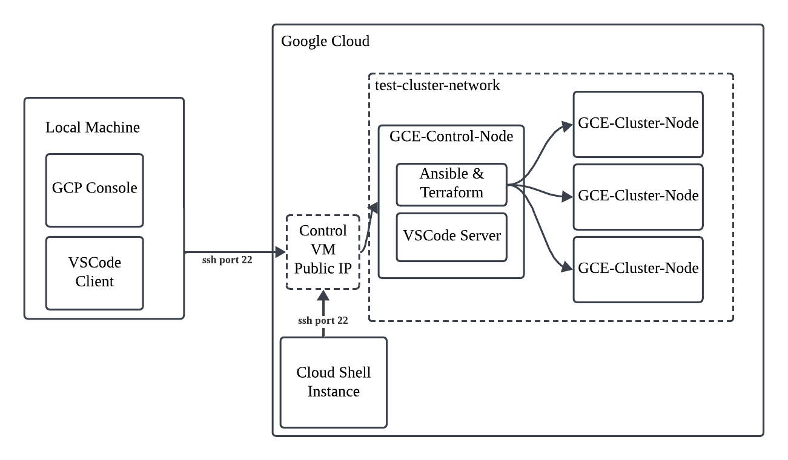

# private-cluster-on-cloud

## Overview

This repository provides the necessary scripts to set up a private cloud environment using GCP. The control node is located in a customized VPC and can spawn VMs for cluster-related testing. The component diagram looks like the following:



## Analysis

Ultimately, we need a set of virtual machines (VMs) that are on the same network and can communicate with each other to act as cluster nodes. Manually creating these machines is both complicated and error-prone, which is why we need Terraform - a tool that provisions a set of VMs in the cloud based on specified configurations. 

How do we set up a VM that has both Ansible and Terraform installed? While we could use our local desktop or laptop, these software tools generally require a Linux system and a unified environment. Therefore, we need another VM that shares the same network as the other VMs. This VM (i.e., node to control other VMs) should also have permission to call the Google Compute Engine (GCE) API to generate the VM cluster.

There's still one pain point: how will we edit the Terraform/Ansible scripts on the Control Node? While we can use nano or vim, that generally provides a poor developer experience. To resolve this, we'll integrate the [VS Code Remote Server](https://code.visualstudio.com/docs/remote/ssh-tutorial) solution.

While the Cloud Shell offered by GCP provides a solution, it is generally preferable to create the control node as a dedicated GCE instance. This approach offers greater control over VM resources and provides a more unified environment that better mimics a private cloud setup, such as a vSphere cluster, compared to Cloud Shell.

## Operation Guide
### Step 0 Prerequisite

You should have a Google Cloud account with a test project created. 

Also, this guide uses the compute engine. So remember to enable the Compute Engine API on the GCP Console; otherwise, an error will be reported.

### Step 1: Prepare the Test Control Node
#### Step 1.1: Provision Test Control Node
The first step is to create a custom VPN and set up the control GCE node. This guide uses the `gcloud` command-line tool to ensure configurations are properly adjusted. To simplify the setup and avoid interference with the local environment, [Cloud Shell](https://cloud.google.com/shell/docs) is a preferred tool in this step. The instructions below assume you have opened a Cloud Shell terminal session. If you prefer to try this on your local machine, make sure to install `gcloud` and run `gcloud auth login` before executing any commands.

Clone this repository to cloud shell terminal:
```
git clone https://github.com/jwhuang42/private-cluster-on-cloud.git $HOME/private-cluster-on-cloud/
```

Add execution permission to the control shell scripts and enters the directory:  
```
chmod +x $HOME/private-cluster-on-cloud/control/*.sh && cd $HOME/private-cluster-on-cloud/control/
```

Init terraform.
``` 
terraform init
```
Apply the script using terraform:
```
terraform apply -auto-approve -var="project_id="$(gcloud config get-value project)"" -var="user=$USER"
```
#### Step 1.2: Set up Test Control Node
Enter the control node:
```
ssh test-control-node
```
Clone the repo also on the new control node:
```
git clone https://github.com/jwhuang42/private-cluster-on-cloud.git $HOME/private-cluster-on-cloud/
```
Add execution permission to the control shell scripts and enters the directory:  
```
chmod +x $HOME/private-cluster-on-cloud/cluster/*.sh && \
      cd $HOME/private-cluster-on-cloud/cluster/ && \
      ./control-startup.sh
```


### Step 2: Establish SSH connection from the Local Machine
On your local machine, create a ssh key pair:  
``` 
ssh-keygen -t ecdsa -b 521 -f ~/.ssh/test_control_node_key -N ""
``` 
Obtain the value of generated public key:  
``` 
cat ~/.ssh/test_control_node_key.pub  
``` 
Go to cloud shell instance and add the public key to the `test-control-node`:  
``` 
gcloud compute instances add-metadata test-control-node \
  --zone=us-central1-a \
  --metadata "ssh-keys=$USER:<public-key-value-from-local-machine>  
``` 
**Note**: the username should be the one used in the control node, not the one on the local machine!

Copy the username on cloud shell (should be the email user registered the GCP project).

Go Back to the local machine and type the following command to ensure ssh client config exist:
```
touch ~/.ssh/config
```
Open the file using any editor you like and add the following section to the config file. Replace the placeholder with proper values. The control node external IP can be identified using GCP console by searching `VM instances`.
``` 
Host test-control-node
    HostName <control-node-external-ip>
    User <username-on-cloud-shell>
    IdentityFile ~/.ssh/test_control_node_key
    BatchMode yes
    StrictHostKeyChecking no
    UserKnownHostsFile /dev/null
``` 

You should now be able to ssh into the test control node from the local machine using the following command:
```
ssh test-control-node
```

### Step 3: Setup VSCode Remote Dev Platform

Set up VSCode remote work using [this guide](https://code.visualstudio.com/docs/remote/ssh#_installation). Open the `test-cluster-terraform` folder on the test control node via VSCode SSH Remote Connection using ssh host `test-control-node`.

### Step 4: Adjust the Terraform as needed

After opening the `test-cluster-terraform` folder, you should see a `main.tf` file. Use any language model to help you understand the purpose of this file and how to configure it for batch VM creation. Then, use Terraform to plan, validate, and apply the configuration.

Check if the cluster provision is planned as expected:
```
terraform plan -var="project="$(gcloud config get-value project)""
```

Apply the script using terraform after proper changes are applied in the `main.tf`:
```
terraform apply -auto-approve -var="project="$(gcloud config get-value project)""
```

Nodes created via this terraform script generally shouldn't be exposed to the public internet. So you might want to learn about ssh tunneling to help you view web pages on those nodes.

## Resource Clean Guide

If you no longer plan to test for a while, remember to release the resources to avoid unnecessary charges.

On the control node, destory the resources:
```
cd $HOME/private-cluster-on-cloud/cluster/ && \
    terraform destroy -auto-approve -var="project="$(gcloud config get-value project)""
```

On the cloud shell instance, destroy the resources:
```
cd $HOME/private-cluster-on-cloud/control/ && \
    terraform destroy -auto-approve -var="project_id="$(gcloud config get-value project)"" -var="user=$USER"
```